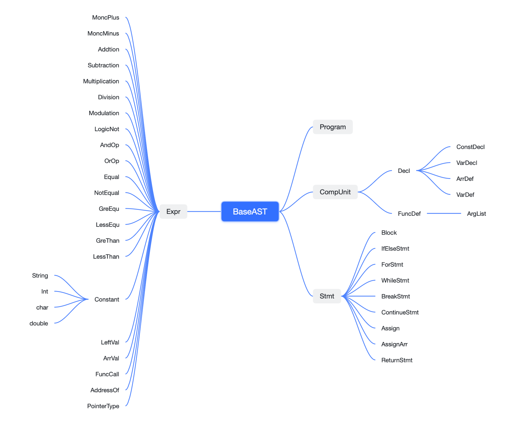
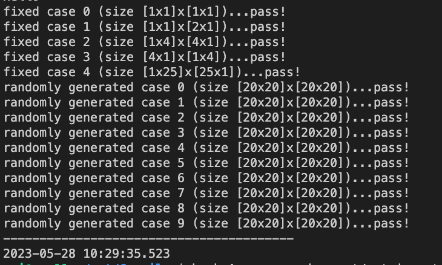
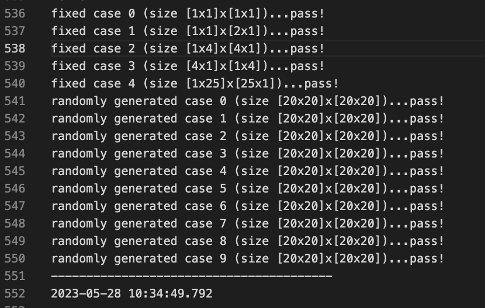

> Ref
>
> 
>
> **实验设计文档**
>
> https://www.chromium.org/developers/design-documents/
>
> https://www.industrialempathy.com/posts/design-docs-at-google
>
> 
>
> 模块名称:xxxx
>
> \1. 这个模块是什么?在整个系统中的地位如何?
>
> \2. 为什么要设计本模块?
>
> \3. 模块设计的具体方案和思想。
>
> \4. 本项目设计此模块的一些特性。
>
> \5. 如何使用本模块。
>
> \6. git 工作流。
>  \7. 其它你认为重要的东西。
>
> 
>
> Sysy: https://gitlab.eduxiji.net/nscscc/compiler2022


# 一、介绍

## 1.1 sysY介绍

本次实验完成了一个sysY语言的编译器，能够分析sysY语言的语法，并将其编译至LLVM IR，最后再编译至目标代码( .o 文件)。

sysY 是一种简单的编程语言，通常用于教学和学术研究目的。sysY 语言的设计旨在提供一个易于理解和实现的语言，用于介绍编译器设计和实现的基本概念。

我们实现的sysY编译器支持以下sysY语言特性:

1. 静态类型：sysY 是一种静态类型语言，所有变量在编译时必须声明其类型，并且类型检查是在编译阶段进行的。类型检查可以帮助捕捉许多常见的编程错误。
2. 基本数据类型：sysY 支持整数和浮点数类型。整数类型可以包括有符号和无符号的整数，可以指定不同的位宽。浮点数类型可以是单精度或双精度。
3. 数组：sysY 支持一维和多维数组。数组的长度可以在声明时指定或在运行时动态分配。可以使用索引访问和修改数组元素。
4. 表达式：sysY 支持基本的算术和逻辑表达式，包括算术运算符（如加法、减法、乘法、除法）、比较运算符（如等于、不等于、大于、小于）和逻辑运算符（如与、或、非）。
5. 控制流语句：sysY 支持条件语句和循环语句。条件语句包括 if-else 语句，根据条件的结果选择不同的执行路径。循环语句包括 for 循环和 while 循环，用于重复执行一段代码块。
6. 函数：sysY 支持函数的定义和调用。函数可以接受参数并返回值。函数定义包括函数名称、参数列表和函数体。函数调用可以将实际参数传递给函数，并接收返回值。
7. 输出语句：sysY 提供了输出语句，用于在程序执行过程中打印输出结果。可以打印字符串常量和变量的值。
8. 作用域：sysY 使用块作用域。变量在定义它们的代码块内可见，并且可以被内部的代码块重新定义。
9. 没有指针和复杂数据结构：sysY 简化了语言设计，不支持指针和复杂的数据结构（如结构体和类）。它专注于基本的数据类型和控制结构。


## 1.2 运行环境说明

- Flex & Bison：使用flex和bison生成词法分析器和语法分析器。
- LLVM-14：基于LLVM标准完成AST的构建、IR代码的生成；同时使用LLVM来完成编译器优化、目标代码生成。
- CMake：使用CMake来构建工程。

### 1.2.1 安装参考
1. 安装环境：Ubuntu22.04
2. `Flex`:`sudo apt-get install flex`
3. `Bison`:`sudo apt-get install Bison`
4. `LLVM`:`sudo apt-get install llvm-14`(由于llvm不同版本接口有所变化，在实验中llvm版本在11即以下无法进行工程构建，请尽量和该版本保持一致)


### 1.2.2 工程搭建
1. 进入工程根目录，工程结构如下：
```
doc/
lib/
Ref/
simple_demo/
src/
tests/
cmake_demo.sh
cmake_src_cllean.sh
cmake_src.sh
README.md
run_src_demo.sh
```

### 1.2.3 使用说明


## 1.3 代码规范

详细的代码规范请见`docs/styleGuide.md`。


## 1.4 分工说明


# 二、实验设计文档

## 2.1 词法分析设计

### 2.1.0 介绍

在实验报告的词法分析部分，我们将详细介绍sysY语言的词法规范和词法分析器的设计与实现过程。我们将描述sysY语言中各种词法单元的定义和识别规则，以及词法分析器的工作原理和算法。我们还将讨论词法错误处理和测试验证的方法，以确保词法分析器的正确性和鲁棒性。通过深入了解词法分析的重要性和功能，我们可以更好地理解编译器的工作原理和实现过程。


### 2.1.1 词法单元的定义和识别规则

1. 关键字（Keywords）：

   - 控制结构关键字：

     - `if`：用于条件语句，根据条件表达式的结果执行相应的代码块。

     - `else`：在条件语句中可选的分支，用于处理条件不满足的情况。

     - `while`：用于循环语句，当条件满足时重复执行代码块。

   - 数据类型关键字：

     - `int`：表示整数类型。

     - `float`：表示浮点数类型。

     - `char`：表示字符类型。

   - 修饰符关键字：

     - `const`：用于声明常量，表示该变量的值在程序执行期间不可修改。

     - `void`：表示无返回值或不接受参数的函数。

2. 标识符（Identifiers）： 标识符用来表示变量、函数、类等用户自定义的命名。

   - 标识符由字母、数字和下划线组成。
   - 标识符必须以字母或下划线开头，不能以数字开头。
   - 标识符区分大小写，因此大小写不同的标识符被视为不同的符号。

3. 常量（Literals）： 常量是固定的数值或字符值，包括整数、浮点数、字符、字符串等。

   - 整数常量：整数常量是不带小数点的数值，可以使用十进制、八进制或十六进制表示。例如：`42`、`0b1010`、`0o77`、`0xFF`。
   - 浮点数常量：浮点数常量是带有小数点的数值。可以使用十进制表示，也可以使用科学计数法表示。例如：`3.14`、`1.23e-5`。
   - 字符常量：字符常量是单个字符，用单引号括起来。例如：`'a'`、`'b'`、`'%'`。
   - 字符串常量：字符串常量是由多个字符组成的序列，用双引号括起来。例如：`"Hello, world!"`、`"sysY"`。

4. 运算符（Operators）： 运算符用于执行各种操作，如算术运算、逻辑运算、比较运算等。sysY语言中包括常见的运算符，如加法、减法、乘法、除法、赋值、逻辑与、逻辑或等。

   - 算术运算符：用于执行基本的算术操作，如加法、减法、乘法和除法。常见的算术运算符包括加号`+`、减号`-`、乘号`*`和除号`/`。
   - 赋值运算符：用于将一个值赋给变量。赋值运算符使用等号`=`表示，例如`a = 5`。
   - 逻辑运算符：用于执行逻辑操作，如逻辑与、逻辑或和逻辑非。逻辑与运算符表示为双与号`&&`，逻辑或运算符表示为双竖线`||`，逻辑非运算符表示为感叹号`!`。
   - 比较运算符：用于比较两个值之间的关系，如相等、不相等、大于、小于等。常见的比较运算符包括等于号`==`、不等于号`!=`、大于号`>`、小于号`<`、大于等于号`>=`和小于等于号`<=`。
   - 位运算符：用于对二进制位进行操作。常见的位运算符包括按位与`&`、按位或`|`、按位取反`~`、按位异或`^`、左移`<<`和右移`>>`。
   - 条件运算符：也称为三元运算符，用于根据条件选择不同的值。条件运算符使用问号`?`和冒号`:`组合，例如`condition ? value1 : value2`。
   - 其他运算符：sysY语言还支持其他一些运算符，如取地址运算符`&`、取值运算符`*`、下标运算符`[]`等。

   运算符在词法分析阶段会被识别为独立的词法单元，并传递给语法分析器进行解析。不同的运算符具有不同的优先级和结合性，编译器会按照运算符的规则进行解析和计算，确保表达式的正确性和准确性。


### 2.1.2 词法规范：正则表达式

在Lex中，正则表达式用于描述词法单元的模式。它们指定了需要匹配的字符序列的规则，并可以与特定的动作关联。以下是一些Lex约定用于描述正则表达式的常见语法：

| 格式  | 含义                           |
| ----- | ------------------------------ |
| a     | 字符a                          |
| "a"   | 即使a是一个元字符，它仍是字符a |
| \a    | 即使a是一个元字符，它仍是字符a |
| a*    | a的零次或多次重复              |
| a+    | a的一次或多次重复              |
| a?    | 一个可选的a                    |
| a\|b  | a或b                           |
| (a)   | a本身                          |
| [abc] | 字符a、b或c中的任一个          |
| [a-d] | 字符a、b、c或d中的任一个       |
| [^ab] | 除了a或b外的任一个字符         |
| .     | 除了新行之外的任一个字符       |
| {xxx} | 名字xxx表示的正则表达式        |


### 2.1.3 词法分析器设计

在词法分析器设计中，采用词法分析器生成工具（Flex）是一种常见的选择。Flex是一个词法分析器生成器，它可以根据给定的正则表达式规则和相应的动作生成用于词法分析的自动识别器。

Lex输入文件由三个部分组成：定义（defination）集，规则（rule）集以及辅助程序（auxiliary）集或用户程序（user routine）集。

```apl
{definations}
%%
{rules}
%%
{auxiliary routines}
```

#### 2.1.3.1 定义部分

```c
%{
#include "AST.hpp"
#include "parser.hpp"
#include <stdio.h>
#include <iostream>
#include <string>

#define SAVE_TOKEN yylval.strVal = new std::string(yytext, yyleng)
// 因为 Flex 会用到 Bison 中关于 token 的定义
// 所以需要 include Bison 生成的头文件
extern "C" int yywrap() {return 1;}

using namespace std;

%}
```


#### 2.1.3.2 规则部分

```c
/* 空白符和注释 */
WHTIESPACE              [ \t\n\r]*
LINECOMMET              "//".*
BLOCKCOMMET             "/*"[^*]*[*]+([^*/][^*]*[*]+)*"/"

/* 整数字面量 */
DECIMAL                 [1-9][0-9]*
OCTAL                   0[0-7]*
HEXADECIMAL             0[xX][0-9a-fA-F]+

/* 浮点数 */
REAL                    [0-9]+\.[0-9]+

/* 字符串 */
STRING                  \"(\\.|[^\"\\])*?\"

/* 标识符 */
IDENTIFIER              [a-zA-Z_][a-zA-Z0-9_]*

%%

    /* 空白符和注释 */
{WHTIESPACE}            {;}
{LINECOMMET}            {;}
{BLOCKCOMMET}           {;}

    /* 运算符 */
    /* 关系运算符 */
"=="                    {return EQU;}
"!="                    {return NEQ;}
"<"                     {return LES;}
"<="                    {return LEQ;}
">"                     {return GRE;}
">="                    {return GEQ;}

    /* 算术运算符 */
"+"                     {return ADD;}
"-"                     {return SUB;}
"*"                     {return MUL;}
"/"                     {return DIV;}
"%"                     {return MOD;}

    /* 逻辑运算符 */
"&&"                    {return AND;}
"||"                    {return OR;}
"!"                     {return NOT;}

    /* 位运算符 */
"&"                     {return BAND;}
"|"                     {return BOR;}
"^"                     {return BXOR;}

    /*分隔符*/
"("             		{ return LPAREN; }
")"             		{ return RPAREN; }
"{"             		{ return LBRACE; }
"}"             		{ return RBRACE; }
"["						{return LBRACKET;}
"]"						{return RBRACKET;}
","                     {return COMMA;}
";"                     {return SEMI;}

    /* 赋值运算符 */
"="                     {return ASSIGN;}

    /* 特殊符号 */
"."                     {return DOT;}
":"                     {return COLON;}
"?"                     {return QUES;}
"..."					{return ELLIPSES;}
"ptr"				    {return PTR;}

    /* 关键字 */
    /* 数据类型 */
"int"                   {SAVE_TOKEN; return INT;}
"short"                 {SAVE_TOKEN; return SHORT;}
"char"                  {SAVE_TOKEN; return CHAR;}
"void"                  {SAVE_TOKEN; return VOID;}

    /* 跳转结构 */
"return"                {return RETURN;}
"continue"              {SAVE_TOKEN; return CONTINUE;}
"break"                 {SAVE_TOKEN; return BREAK;}

    /* 分支结构 */
"if"                    {SAVE_TOKEN; return IF;}
"else"                  {SAVE_TOKEN; return ELSE;}

    /* 循环结构 */
"for"                   {SAVE_TOKEN; return FOR;}
"while"                 {SAVE_TOKEN; return WHILE;}

"static"                {SAVE_TOKEN; return STATIC;}

{STRING}                {
                            yylval.strVal = new std::string("");
                            for (int i = 1; i <= yyleng-2; i++){
                                if (yytext[i] == '\\') {
                                    i ++; 
                                    switch(yytext[i]) {
                                        case 'n': yylval.strVal->push_back('\n'); break; 
                                        case 't': yylval.strVal->push_back('\t'); break; 
                                        default: yylval.strVal->push_back(yytext[i]);
                                    }
                                }
                                else {
                                    yylval.strVal->push_back(yytext[i]);
                                }
                            }
                            return CONST_STR;
                        }


{IDENTIFIER}            {SAVE_TOKEN; return IDENTIFIER;}


{DECIMAL}               { yylval.intVal = strtol(yytext, nullptr, 0); return CONST_INT; }
{OCTAL}                 { yylval.intVal = strtol(yytext, nullptr, 0); return CONST_INT; }
{HEXADECIMAL}           { yylval.intVal = strtol(yytext, nullptr, 0); return CONST_INT; }
 
{REAL}                  { yylval.floatVal = strtol(yytext, nullptr, 0); return CONST_FLOAT; }

"\'"[^\\']"\'"			{ yylval.charVal = yytext[1]; return CONST_CHAR; }


.                       { printf("Unknown token!/n");}
```


## 2.2 语法分析设计

### 2.2.1 介绍

语法分析在编译器中扮演着关键的角色，它将源代码转化为抽象语法树表示，为后续的编译器阶段提供了基础。


### 2.2.2 语法规范

以下是sysY语言的正式语法规范，使用巴科斯范式（BNF）描述语法规则。

以下为设计过程中的部分规则描述：

```
<program> ::= <declaration_list>

<declaration_list> ::= <declaration> | <declaration_list> <declaration>

<declaration> ::= <type_specifier> <identifier> ";" | <type_specifier> <identifier> "(" ")" <compound_statement>

<type_specifier> ::= "int" | "void"

<identifier> ::= <letter> <identifier_tail>

<identifier_tail> ::= <letter_or_digit> <identifier_tail> | ε

<letter> ::= "A" | "B" | ... | "Z" | "a" | "b" | ... | "z"

<letter_or_digit> ::= <letter> | <digit>

<compound_statement> ::= "{" <local_declarations> <statement_list> "}"

<local_declarations> ::= <local_declaration> | <local_declarations> <local_declaration>

<local_declaration> ::= <type_specifier> <identifier> ";"

<statement_list> ::= <statement> | <statement_list> <statement>

<statement> ::= <expression_statement> | <compound_statement> | <selection_statement> | <iteration_statement> | <return_statement>

<expression_statement> ::= <expression> ";" | ";"

<selection_statement> ::= "if" "(" <expression> ")" <statement> | "if" "(" <expression> ")" <statement> "else" <statement>

<iteration_statement> ::= "while" "(" <expression> ")" <statement>

<return_statement> ::= "return" <expression> ";" | "return" ";"

<expression> ::= <var> "=" <expression> | <simple_expression>

<var> ::= <identifier>

<simple_expression> ::= <additive_expression> | <simple_expression> <relop> <additive_expression>

<additive_expression> ::= <term> | <additive_expression> <addop> <term>

<term> ::= <factor> | <term> <mulop> <factor>

<factor> ::= <var> | <call> | <num> | "(" <expression> ")"

<call> ::= <identifier> "(" ")" | <identifier> "(" <args> ")"

<args> ::= <expression> | <args> "," <expression>

<relop> ::= "<" | "<=" | ">" | ">=" | "==" | "!="

<addop> ::= "+" | "-"

<mulop> ::= "*" | "/"

<num> ::= <digit> | <digit> <num>

<digit> ::= "0" | "1" | ... | "9"
```

sysY语言的关键字包括：`int`, `void`, `if`, `else`, `while`, `return`。

sysY语言的运算符包括：`+`, `-`, `*`, `/`, `=`, `<`, `<=`, `>`, `>=`, `==`, `!=`。

sysY语言的语法结构包括：程序（`<program>`）、声明列表（`<declaration_list>`）、声明（`<declaration>`）、类型说明符（`<type_specifier>`）、标识符（`<identifier>`）、复合语句（`<compound_statement>`）、局部声明列表（`<local_declarations>`）、局部声明（`<local_declaration>`）、语句列表（`<statement_list>`）、语句（`<statement>`）、表达式语句（`<expression_statement>`）、选择语句（`<selection_statement>`）、循环语句（`<iteration_statement>`）、返回语句（`<return_statement>`）、表达式（`<expression>`）、变量（`<var>`）、简单表达式（`<simple_expression>`）、加法表达式（`<additive_expression>`）、项（`<term>`）、因子（`<factor>`）、函数调用（`<call>`）、实参列表（`<args>`）、关系运算符（`<relop>`）、加法运算符（`<addop>`）、乘法运算符（`<mulop>`）、数字（`<num>`）、数字字符（`<digit>`）。

这些语法规则和符号定义了sysY语言的语法结构和语法规则，编译器在语法分析阶段将根据这些规则进行源代码的解析和构建抽象语法树（AST）。


### 2.2.3 语法分析器设计方案

在设计sysY编译器的语法分析器时，采用了自底向上的语法分析方法，并选择了LALR(1)解析算法。为了实现语法分析器，使用了Yacc/Bison作为语法分析器生成工具。

自底向上的语法分析方法以输入的源代码作为起点，逐步构建语法规则的右部，并最终推导出起始符号，生成抽象语法树（AST）。相较于自顶向下方法，自底向上方法可以处理更复杂的文法，并具有更强的语法表达能力。

LALR(1)解析算法是一种常用的自底向上解析算法，它使用了向前看一个符号（Look-Ahead 1）来进行决策。LALR(1)算法通过构建LR(1)项目集族和状态转换表来解析输入的源代码。这种解析算法具有较高的效率和广泛的应用性。

为了生成语法分析器，选择了Yacc/Bison作为工具。Yacc/Bison是一对用于生成语法分析器的工具，它们根据提供的文法规范自动生成相应的语法分析器代码。通过定义文法规则和语义动作，Yacc/Bison可以生成解析输入的源代码，并构建抽象语法树。

在sysY编译器的设计中，通过编写sysY语言的文法规范并使用Yacc/Bison工具，生成了相应的语法分析器。该语法分析器利用LALR(1)解析算法来解析输入的源代码，并生成抽象语法树作为后续编译过程的基础。

采用自底向上的语法分析方法、LALR(1)解析算法以及Yacc/Bison工具，可以确保sysY编译器能够准确、高效地进行语法分析，并生成正确的抽象语法树。


#### 2.2.3.1 定义部分

定义部分定义了CFG语法中`non-terminal`的类型、`terminal`的TOKEN和运算符的优先级。定义优先级时，`%left`，`%right`定义结合性，越后定义的运算优先级高。

```c
%union {
    std::string* strVal;
	float floatVal;
    int intVal;
	char charVal;
    BaseAST *astVal;
	CompUnits *compUnits;
	Stmts *stmts;
	Exprs *exprs;
    ArgAST *argVal;
    ArgListAST *argList;
    ExprListAST *exprList;
    ExprAST *expVal;
    PointerType *ptrType;
}

/* 终结符 */
// lexer 返回的所有 token 种类的声明
%token EQU NEQ LES LEQ GRE GEQ
%token ADD SUB MUL DIV MOD
%token AND OR NOT
%token BAND BOR BXOR
%token LPAREN RPAREN LBRACE RBRACE  LBRACKET RBRACKET COMMA SEMI
%token ASSIGN DOT COLON QUES ELLIPSES PTR

%token <strVal> INT CHAR SHORT VOID
%token RETURN CONTINUE BREAK STATIC
%token IF ELSE
%token FOR WHILE
%token STATIC

%token CONST
%token <strVal> IDENTIFIER
%token <intVal> CONST_INT 
%token <charVal> CONST_CHAR 
%token <strVal> CONST_STR
%token CONST_FLOAT
// 非终结符的类型定义

%type <astVal> Program
%type <compUnits> CompUnit
%type <astVal> FuncDef
%type <strVal> FuncType

%type <argList> ArgList
%type <argList> _ArgList
%type <argVal> Arg
%type <ptrType> PtrType

%type <exprList> ExpList
%type <exprList> _ExpList

%type <astVal> Decl
%type ConstDecl
%type ConstDef
%type ConstList
%type <astVal> ConstExp
%type ConstInitVal
%type <astVal> VarDecl
%type <strVal> Btype
%type VarList
%type <astVal> VarDef


%type <exprs> ArrDef ArrVal
%type <astVal> InitVal

%type <astVal> Block
%type <astVal> BlockItem 
%type <stmts>  BlockItemNew
%type <astVal> Stmt SmooStmt

%type <astVal> PrimaryExp
%type <astVal> Exp
%type <astVal> ElseState
%type <astVal> RetState

%type <astVal> LVal
%type <intVal> Number
%type <astVal> Constant

%type <astVal> ArrValF

/* 优先级和结合性定义 */
%right	ASSIGN
%left	OR
%left	AND
%left	BOR
%left	BXOR
%left	BAND
%left	EQU NEQ
%left	GEQ GRE LES LEQ
%left	ADD SUB
%left	MUL DIV MOD
```


#### 2.2.3.2 规则部分

```c
Program							
	: CompUnit 											{ $$ = new ProgramAST((CompUnits*)$1); Root = $$;}
	;

CompUnit
    : CompUnit STATIC Decl                      { $$ = (CompUnits*)$1; $$->push_back((CompUnitAST*)$3); }
    | CompUnit FuncDef									        { $$ = (CompUnits*)$1; $$->push_back((CompUnitAST*)$2); }
    | 													{ $$ = new CompUnits(); }
    ;

/* Decl          ::= ConstDecl | VarDecl; */
Decl
    : ConstDecl
    | VarDecl                                           { $$ = $1; }
    ;

/* ConstDecl     ::= "const" BType ConstDef {"," ConstDef} ";"; */
ConstDecl
    : CONST Btype ConstDef ConstList SEMI
    ;

ConstList
    : ConstList COMMA ConstDef
    |
    ;

/* BType         ::= "int"; */
Btype
    : VOID                          { $$ = $1; }
    | INT                           { $$ = $1; }
    | SHORT                         { $$ = $1; }
    | CHAR                          { $$ = $1; }
    ;

/* ConstDef      ::= IDENT "=" ConstInitVal; */
ConstDef
    : IDENTIFIER ASSIGN ConstInitVal
    ;

/* ConstInitVal  ::= ConstExp; */
ConstInitVal
    : ConstExp
    ;

/* VarDecl       ::= BType VarDef {"," VarDef} ";"; */
VarDecl
    : Btype VarDef VarList SEMI                     { $$ = new VarDeclAST(*$1, (VarDefAST*)$2);}
	| Btype IDENTIFIER ArrDef SEMI					{ $$ = new ArrDefAST(*$1, *$2, (Exprs*)$3); }
    ;

VarList
    : VarList COMMA VarDef
    |                                               { ; }
    ;

/* VarDef        ::= IDENT | IDENT "=" InitVal; */
VarDef
    : IDENTIFIER                                    { $$ = new VarDefAST(*$1);}
    | IDENTIFIER ASSIGN InitVal                     { $$ = new VarDefAST(*$1, (ExprAST*)$3);}
    ;

ArrDef
	: ArrDef LBRACKET ConstExp RBRACKET 			{ $$ = (Exprs*)$1; $$->push_back((ExprAST*)$3); }
	| 												{ $$ = new Exprs(); }
	;

/* InitVal       ::= Exp; */
InitVal
    : Exp                                           { $$ = $1; }
    ;

FuncDef
    : FuncType IDENTIFIER LPAREN ArgList RPAREN SEMI    { $$ = new FuncDefAST(*$1, *$2, (ArgListAST*)$4); }
    | FuncType IDENTIFIER LPAREN ArgList RPAREN Block   { $$ = new FuncDefAST(*$1, *$2, (ArgListAST*)$4, (BlockAST*)$6); }
    ;


/* FuncType      ::= "void" | "int"; */
FuncType
    : INT                                       { $$ = $1; }
    | VOID                                      { $$ = $1; }
    | CHAR                                      { $$ = $1; }
    ;


ArgList
    : _ArgList COMMA Arg									{  $$ = $1; $$->push_back($3);   }
	| _ArgList COMMA ELLIPSES								{  $$ = $1; $$->SetVarArg();   }
	| Arg													{  $$ = new ArgListAST(); $$->push_back($1);   }
	| ELLIPSES												{  $$ = new ArgListAST(); $$->SetVarArg();   }
	|														{  $$ = new ArgListAST(); }
	;

_ArgList
    : _ArgList COMMA Arg										{  $$ = $1; $$->push_back($3);   }	 
	| Arg													{  $$ = new ArgListAST(); $$->push_back($1);   }
	;

PtrType
    : Btype PTR                                                     { $$ = new PointerType(*$1); }
    ;

Arg
    : Btype IDENTIFIER										{  $$ = new ArgAST(*$1, *$2);   }
	| PtrType IDENTIFIER							        {  $$ = new ArgAST($1, *$2);   }
	| PtrType 							                    {  $$ = new ArgAST($1);   }


/* Block         ::= "{" {BlockItem} "}"; */
Block
    : LBRACE BlockItemNew RBRACE                { $$ = new BlockAST((Stmts*)$2);}
    ;

BlockItemNew
    : BlockItemNew BlockItem					{ $$ = (Stmts*)$1; if ($2 != NULL)$$->push_back((CompUnitAST*)$2); }
    | 											{ $$ = new Stmts(); }
    ;

/* BlockItem     ::= Decl | Stmt; */
BlockItem
    : Decl                                      { $$ = $1;}
    | Stmt										{ $$ = $1;}
    ;

SmooStmt
    : LVal ASSIGN Exp						{ $$ = new AssignAST((LeftValAST*)$1, (ExprAST*)$3); }
    | Exp								    { $$ = $1; }
	| ArrValF ASSIGN Exp					{ $$ = new AssignArrAST((ArrValAST*)$1, (ExprAST*)$3); }
    | 									    { $$ = NULL; }
    | BREAK                                 { $$ = new BreakStmtAST(); }
    | CONTINUE                              { $$ = new ContinueStmtAST(); }
    | RETURN RetState					    { $$ = new ReturnStmtAST((ExprAST*)$2);}

Stmt
    : SmooStmt SEMI						        { $$ = $1; }
    | Block										{ $$ = $1; }
    | FOR LPAREN SmooStmt SEMI Exp SEMI SmooStmt RPAREN Block   { $$ = new ForStmtAST((StmtAST*)$3, (ExprAST*)$5, (StmtAST*)$7, (BlockAST*)$9); }
    | IF LPAREN Exp RPAREN Block ElseState      { $$ = new IfElseStmtAST((ExprAST*)$3, (BlockAST*)$5, (BlockAST*)$6); }
    | WHILE LPAREN Exp RPAREN Block             { $$ = new WhileStmtAST((ExprAST*)$3, (BlockAST*)$5); }
    ;

LVal
    : IDENTIFIER								{ $$ = new LeftValAST(*$1); }
    ;

ArrValF
	: IDENTIFIER ArrVal							{ $$ = new ArrValAST(*$1, (Exprs*)$2); }

ArrVal
	: ArrVal LBRACKET Exp RBRACKET		{ $$ = (Exprs*)$1; $$->push_back((ExprAST*)$3); }
	|									{ $$ = new Exprs(); }
	;

ElseState
    : ELSE Block                        {$$ = $2; }
    |                                   {$$ = NULL; }
    ;

RetState
    : Exp								{$$ = $1;}
    |                                   {$$ = NULL; }
    ;

PrimaryExp
    : LPAREN Exp RPAREN					{ $$ = $2; }
    | LVal								{ $$ = $1; }
    | Constant							{ $$ = $1; }	
    ;

Constant
    : CONST_INT							{ $$ = new Constant($1); }
    | CONST_CHAR						{ $$ = new Constant($1); }
    | CONST_STR                         { $$ = new StringType(*$1); }
    ;

Exp
    : PrimaryExp						{ $$ = $1; }	
	| ArrValF							{ $$ = (ArrValAST*)$1; }					
    | ADD Exp %prec NOT					{ $$ = new MoncPlus((ExprAST*)$2); }
    | SUB Exp %prec NOT					{ $$ = new MoncMinus((ExprAST*)$2); }
    | NOT Exp							{ $$ = new LogicNot((ExprAST*)$2); }
    | BAND LVal	%prec NOT			    { $$ = new AddressOf((LeftValAST*)$2); }

    | Exp ADD Exp						{$$ = new Addition((ExprAST*)$1, (ExprAST*)$3);}
    | Exp SUB Exp						{$$ = new Subtraction((ExprAST*)$1, (ExprAST*)$3);}
    | Exp MUL Exp						{$$ = new Multiplication((ExprAST*)$1, (ExprAST*)$3);}
    | Exp DIV Exp						{$$ = new Division((ExprAST*)$1, (ExprAST*)$3);}
    | Exp MOD Exp						{$$ = new Modulation((ExprAST*)$1, (ExprAST*)$3);}

    | Exp EQU Exp						{$$ = new Equal((ExprAST*)$1, (ExprAST*)$3);}
    | Exp NEQ Exp						{$$ = new NotEqual((ExprAST*)$1, (ExprAST*)$3);}
    | Exp LES Exp						{$$ = new LessThan((ExprAST*)$1, (ExprAST*)$3);}
    | Exp LEQ Exp						{$$ = new LessEqu((ExprAST*)$1, (ExprAST*)$3);}
    | Exp GRE Exp						{$$ = new GreThan((ExprAST*)$1, (ExprAST*)$3);}
    | Exp GEQ Exp						{$$ = new GreEqu((ExprAST*)$1, (ExprAST*)$3);}

    | Exp AND Exp						{$$ = new AndOp((ExprAST*)$1, (ExprAST*)$3);}
    | Exp OR  Exp						{$$ = new OrOp((ExprAST*)$1, (ExprAST*)$3);}

    | Exp BAND Exp
    | Exp BOR  Exp
    | Exp BXOR Exp

    | IDENTIFIER LPAREN ExpList RPAREN	 {  $$ = new FuncCallAST(*$1, $3);   }
	;

ExpList
    : _ExpList COMMA Exp							    {  $$ = $1; $$->push_back((ExprAST*)$3);   }
	| Exp                           					{  $$ = new ExprListAST(); $$->push_back((ExprAST*)$1);   }
	|													{  $$ = new ExprListAST();   }
	;

_ExpList
    : _ExpList COMMA Exp 								{  $$ = $1; $$->push_back((ExprAST*)$3);   }
	| Exp                       						{  $$ = new ExprListAST(); $$->push_back((ExprAST*)$1);   }
	;

ConstExp
	: CONST_INT							{ $$ = new Constant($1); }
	;
%%
```


### 2.2.4 抽象语法树（AST）

AST的结构和表示方式可以根据具体的语言和编译器实现而有所不同，但通常包含以下类型的节点：

1. 标识符（Identifier）节点：用于表示变量、函数名等标识符的节点。
2. 常量（Const）节点：用于表示常量值的节点，如整数、浮点数、字符串等。
3. 表达式（Expression）节点：用于表示各种表达式，如算术表达式、逻辑表达式、赋值表达式等。
4. 语句（Statement）节点：用于表示各种语句，如条件语句、循环语句、函数调用语句等。
5. 声明（Declaration）节点：用于表示变量声明、函数声明等语句。
6. 类型（Type）节点：用于表示变量或表达式的数据类型。
7. 控制流（Control Flow）节点：用于表示程序的控制流结构，如条件分支、循环等。




#### 2.2.4.1 BaseAST类

BaseAST类是抽象语法树每个节点的纯虚类型，包括空的构造、析构函数和纯虚函数`IRGen`

```cpp
// 所有 AST 的基类
class BaseAST {
public:
	BaseAST() {}
    ~BaseAST() {}

    virtual llvm::Value* IRGen(IRGenerator& IRContext) = 0;
};
```


#### 2.2.4.2 ProgramAST类

##### Todo


#### 2.2.4.3 DeclAST类

##### Todo


#### 2.2.4.4 StmtAST类

##### Todo


#### 2.2.4.5 ExprAST类

##### Todo


#### 2.2.4.6 BlockAST类

##### Todo


#### 2.2.4.7 VarType类

##### Todo


#### 2.2.4.5 示例代码及对应AST结构介绍

##### Todo： 要根据我们的AST修改，下面给出模版

下面是一个示例代码和其对应的简化的AST结构：

示例代码：

```
cssCopy code
int a = 10;
int b = 5;
int result = a + b;
```

对应的AST结构：

```
markdownCopy code
- Program
  - DeclarationStatement
    - TypeNode (int)
    - IdentifierNode (a)
    - LiteralNode (10)
  - DeclarationStatement
    - TypeNode (int)
    - IdentifierNode (b)
    - LiteralNode (5)
  - DeclarationStatement
    - TypeNode (int)
    - IdentifierNode (result)
    - BinaryExpressionNode (+)
      - IdentifierNode (a)
      - IdentifierNode (b)
```

在这个简化的AST中，根节点是Program节点，表示整个程序。每个DeclarationStatement节点表示一个变量的声明语句，包含变量的类型、标识符和初始值（如果有）。BinaryExpressionNode节点表示两个标识符相加的表达式。

通过构建和遍历AST，编译器可以从源代码中提取出语法结构和语义信息，并进行后续的分析和转换操作。


### 2.2.5 语法分析器的测试和验证

##### Todo

> 1. 编写测试用例：编写一组全面而具有代表性的测试用例，覆盖语法分析器的不同语法规则和边界情况。测试用例应包括合法的输入代码和非法的输入代码，以验证语法分析器的正确性和错误处理能力。
> 2. 语法规范验证：将测试用例与sysY语言的正式语法规范进行比对，确保语法分析器按照规范正确解析输入代码。检查是否有任何未处理的语法结构或语法错误。
> 3. 边界情况测试：测试处理语法规范中定义的边界情况，例如最大允许的标识符长度、嵌套层数等。验证语法分析器在处理这些特殊情况时是否能够正确识别和处理。
> 4. 错误处理测试：编写包含语法错误的测试用例，例如缺少分号、括号不匹配等。验证语法分析器能够准确地检测和报告这些错误，并给出恰当的错误信息。
> 5. 性能测试：对语法分析器进行性能测试，包括处理大型源代码文件或具有复杂语法结构的代码。评估语法分析器在处理大规模代码时的效率和内存消耗情况。
> 6. 与参考实现对比：如果有其他编译器或解析器实现sysY语言的参考实现，可以将测试用例同时运行在语法分析器和参考实现上，并对比其结果。这可以帮助发现潜在的问题或差异，并确保语法分析器的正确性。
> 7. 随机测试：使用随机生成的代码片段作为输入，测试语法分析器的鲁棒性和稳定性。这可以帮助发现不常见的错误情况和边界条件。
> 8. 自动化测试：建立自动化测试框架，包括编写自动化测试脚本和断言，以便能够快速运行和验证语法分析器的正确性。自动化测试可以提高测试的覆盖率和效率。


### 2.2.6 语法错误处理

##### Todo


### 2.2.7 AST可视化

##### Todo


## 2.3 语义分析设计

### 2.3.1 介绍

语义分析的主要目标是对源代码进行静态检查，发现和修复语义错误，并为后续阶段生成中间表示或目标代码提供准确的语义信息。

我们使用了LLVM的接口，手动将AST转化符合LLVM标准的IR代码


### 2.3.2 语义规则

##### Todo：以下四个模块加详细介绍或者代码

#### 2.3.2.1 类型检查

sysY语言是一种静态类型语言，因此在编译时会进行类型检查以确保操作的正确性。语义分析器将检查每个表达式和语句中的操作数和运算符之间的类型兼容性。例如，对于算术运算符，要求操作数必须具有相同的类型或可以进行隐式类型转换。如果发现类型不匹配或不兼容的情况，语义分析器将生成相应的类型错误。


#### 2.3.2.2 符号表和作用域规则

sysY语言使用块作用域规则，即在特定的代码块内声明的变量只在该块及其子块中可见。语义分析器将检查变量的作用域是否正确，并防止在非法的位置引用变量。例如，对于变量的引用，语义分析器会检查变量是否在当前作用域内可见。


#### 2.3.2.3  变量声明和使用规则

sysY语言要求在使用变量之前先进行声明。语义分析器将检查变量是否在使用之前已被声明，并且在同一作用域内不允许重复声明相同名称的变量。此外，语义分析器还会验证变量的类型和作用域等信息。


#### 2.3.2.4 函数调用和参数匹配

在sysY语言中，函数调用要求参数的数量和类型与函数声明中的参数列表匹配。语义分析器将检查函数调用的参数数量和类型是否正确，并匹配对应的函数声明。如果存在参数不匹配的情况，语义分析器将生成相应的错误消息。


### 2.3.3 语义类型

##### Todo

#### 2.3.3.1 Declare类


#### 2.3.3.2 Stmt抽象类


#### 2.3.3.3  VarType抽象类


#### ExprAST

##### 注意点
本次实验中为了方便实验设计，对C语言中的表达式进行了更加严格的限制（参考SysY语言进行设计），具体要求如下：

- 赋值时，表达式左值必须是变量，例如:`a,b,c,d[1][2]`；
- 赋值时，表达式的左值需要提供有一个存储空间；
- 赋值时，表达式右值必须具有返回值，本次实验中具体为一般的逻辑运算、大小比较、算术运算；
- 非赋值时，可以是任意支持的表达式。

而在LLVM中，所有创建的变量都是通过提供指向这一变量存储空间的指针来实现的，当要获取变量的值时通过`CreateLoad()`进行获取，当要改变变量的值时通过`CreateStore()`来实现。因此在我们实现的编译器中，对上述提到的合法左值提供一个`IRGenPtr()`函数以获取指向存储空间的指针，对所有表达式提供`IRGen()`函数来获取其存储空间内的值。

设计的`ExprAST`抽象类如下：
```

```

##### 支持字面量
我们编译器支持以下字面量：
- INTEGER
- CHAR
- REAL

##### 右值支持类
如上文所说，一般的右值支持类只需要返回结果而不需要提供存储地址，因此只需要实现`IRGen()`函数即可。

###### 一般运算

##### 左值支持类
左值在满足其作为右值的基础上，需要提供一个指向存储空间的指针，因此需要设计`IRGenPtr()`函数以获取指向存储空间的指针。

###### LeftValAST类
`LeftValAST`类表示一般的变量，
###### ArrValAST类
`ArrValAST`类表示数组类变量。


### 2.3.4 语义错误处理

##### Todo

> 说明语义分析器如何检测和报告语义错误，包括类型错误、未声明的变量、重复声明等。解释语义错误的分类和处理策略，如报错、警告或修复。


## 2.4 运行环境设计

#### Todo

### 2.4.1 创建IR上下文环境


### 2.4.2 创建IR模块


### 2.4.3 符号表


### 2.4.4 记录当前函数


### 2.4.5 break & continue 目的地址栈


### 2.4.6 结构体/共用体映射表


## 2.5 代码生成设计

首先实例化`llvm::sys::getDefaultTargetTriple`，该对象包含了目标机器的许多参数。然后我们调用`llvm::TargetMachine`的接口即可把LLVM中间代码编译成目标机器的汇编代码。具体请参考LLVM官方文档。

```cpp
void IRGenerator::GenObjectCode(std::string outputfile) {
	//获取描述编译器的目标平台、操作系统和环境等信息
	auto TargetTriple = llvm::sys::getDefaultTargetTriple();
	//根据llvm文档提供的初始化
    llvm::InitializeAllTargetInfos();
    llvm::InitializeAllTargets();
    llvm::InitializeAllTargetMCs();
    llvm::InitializeAllAsmParsers();
    llvm::InitializeAllAsmPrinters();

	//根据TargetTriple查找目标平台
    std::string Error;
    auto Target = llvm::TargetRegistry::lookupTarget(TargetTriple, Error);

    llvm::TargetOptions opt;
    auto RM = llvm::Optional<llvm::Reloc::Model>();
    auto TargetMachine = Target->createTargetMachine(TargetTriple, "", "", opt, RM);
	//设置数据布局
    Module->setDataLayout(TargetMachine->createDataLayout());
    Module->setTargetTriple(TargetTriple);

	//将数据写入文件
	std::error_code errCode;
    llvm::raw_fd_ostream OPFile(outputfile, errCode, llvm::sys::fs::OF_None);
    llvm::legacy::PassManager PM;
    TargetMachine->addPassesToEmitFile(PM, OPFile, nullptr, llvm::CGFT_ObjectFile);
    PM.run(*Module);

    OPFile.flush();
}
```


## 2.6 符号表设计

##### Todo


# 三、运行结果

> 请附上你的源语言在你的编译器下的产生二进制或其他东西的过程，以及在第二节功能测试中的结果。

## 3.1 QuickSort

#### 测试代码：

```c
int printk(int ptr, ...);
int scank(char ptr, ...);

int quicksort(int ptr a, int left, int right){
	//printk("QuickSort\n");
	int i = left;
	int	j = right;
	int temp = i + j;
	temp = temp/2;
	//printk(" %d %d %d @@@", temp, left, right);
	int mid;
	mid = a[temp];
	//printk(" %d# ", mid);
	while (i < j){
		while (a[i] < mid) {
            i = i + 1;
			//printk("What i%d?\n",i);
        }
		while (mid < a[j]){
            j = j - 1;
			//printk("What j%d?\n",j);
        }
		if (i <= j){
			int temp = a[i];
			a[i] = a[j];
			a[j] = temp;
			i = i + 1;
            j = j - 1;
		}
		//printk("\n");
	}
	
	if (left < j) {
        quicksort(a, left, j);
    }
	if (i < right) {
        quicksort(a, i, right);
    }

    return 0;
}

int main(){
	int n;
    int temp;
	int a[10000];
	scank("%d", &n);
    int i;
	
	for (i = 0; i < n; i = i + 1){
        scank("%d", &temp);
        a[i] = temp;
    }
		
	quicksort(a, 0, n - 1);
	for (i = 0; i < n; i=i+1){
		printk("%d\n", a[i]);
    }
    
	return 0;
}
```

#### IR代码：

```
; ModuleID = 'main'
source_filename = "main"

@0 = private unnamed_addr constant [3 x i8] c"%d\00", align 1
@1 = private unnamed_addr constant [3 x i8] c"%d\00", align 1
@2 = private unnamed_addr constant [4 x i8] c"%d\0A\00", align 1

declare i32 @printk(i32*, ...)

declare i32 @scank(i8*, ...)

define i32 @quicksort(i32* %0, i32 %1, i32 %2) {
BBEntry:
  %right = alloca i32, align 4
  store i32 %2, i32* %right, align 4
  %left = alloca i32, align 4
  store i32 %1, i32* %left, align 4
  %a = alloca i32*, align 8
  store i32* %0, i32** %a, align 8
  %i = alloca i32, align 4
  %3 = load i32, i32* %left, align 4
  store i32 %3, i32* %i, align 4
  %j = alloca i32, align 4
  %4 = load i32, i32* %right, align 4
  store i32 %4, i32* %j, align 4
  %temp = alloca i32, align 4
  %5 = load i32, i32* %i, align 4
  %6 = load i32, i32* %j, align 4
  %7 = add i32 %5, %6
  store i32 %7, i32* %temp, align 4
  %8 = load i32, i32* %temp, align 4
  %9 = sdiv i32 %8, 2
  store i32 %9, i32* %temp, align 4
  %mid = alloca i32, align 4
  store i8 0, i32* %mid, align 1
  %10 = load i32, i32* %temp, align 4
  %11 = load i32*, i32** %a, align 8
  %12 = getelementptr i32, i32* %11, i32 %10
  %13 = load i32, i32* %12, align 4
  store i32 %13, i32* %mid, align 4
  br label %WhileCmp

WhileCmp:                                         ; preds = %BBExit, %BBEntry
  %14 = load i32, i32* %i, align 4
  %15 = load i32, i32* %j, align 4
  %16 = icmp slt i32 %14, %15
  br i1 %16, label %BBEntry1, label %WhileExit

WhileExit:                                        ; preds = %WhileCmp
  %17 = load i32, i32* %left, align 4
  %18 = load i32, i32* %j, align 4
  %19 = icmp slt i32 %17, %18
  br i1 %19, label %BBEntry10, label %BBExit11

BBEntry1:                                         ; preds = %WhileCmp
  br label %WhileCmp2

WhileCmp2:                                        ; preds = %BBEntry4, %BBEntry1
  %20 = load i32, i32* %i, align 4
  %21 = load i32*, i32** %a, align 8
  %22 = getelementptr i32, i32* %21, i32 %20
  %23 = load i32, i32* %22, align 4
  %24 = load i32, i32* %mid, align 4
  %25 = icmp slt i32 %23, %24
  br i1 %25, label %BBEntry4, label %WhileExit3

WhileExit3:                                       ; preds = %WhileCmp2
  br label %WhileCmp5

BBEntry4:                                         ; preds = %WhileCmp2
  %26 = load i32, i32* %i, align 4
  %27 = add i32 %26, 1
  store i32 %27, i32* %i, align 4
  br label %WhileCmp2

WhileCmp5:                                        ; preds = %BBEntry7, %WhileExit3
  %28 = load i32, i32* %mid, align 4
  %29 = load i32, i32* %j, align 4
  %30 = load i32*, i32** %a, align 8
  %31 = getelementptr i32, i32* %30, i32 %29
  %32 = load i32, i32* %31, align 4
  %33 = icmp slt i32 %28, %32
  br i1 %33, label %BBEntry7, label %WhileExit6

WhileExit6:                                       ; preds = %WhileCmp5
  %34 = load i32, i32* %i, align 4
  %35 = load i32, i32* %j, align 4
  %36 = icmp sle i32 %34, %35
  br i1 %36, label %BBEntry8, label %BBExit

BBEntry7:                                         ; preds = %WhileCmp5
  %37 = load i32, i32* %j, align 4
  %38 = sub i32 %37, 1
  store i32 %38, i32* %j, align 4
  br label %WhileCmp5

BBEntry8:                                         ; preds = %WhileExit6
  %temp9 = alloca i32, align 4
  %39 = load i32, i32* %i, align 4
  %40 = load i32*, i32** %a, align 8
  %41 = getelementptr i32, i32* %40, i32 %39
  %42 = load i32, i32* %41, align 4
  store i32 %42, i32* %temp9, align 4
  %43 = load i32, i32* %j, align 4
  %44 = load i32*, i32** %a, align 8
  %45 = getelementptr i32, i32* %44, i32 %43
  %46 = load i32, i32* %45, align 4
  %47 = load i32, i32* %i, align 4
  %48 = load i32*, i32** %a, align 8
  %49 = getelementptr i32, i32* %48, i32 %47
  store i32 %46, i32* %49, align 4
  %50 = load i32, i32* %temp9, align 4
  %51 = load i32, i32* %j, align 4
  %52 = load i32*, i32** %a, align 8
  %53 = getelementptr i32, i32* %52, i32 %51
  store i32 %50, i32* %53, align 4
  %54 = load i32, i32* %i, align 4
  %55 = add i32 %54, 1
  store i32 %55, i32* %i, align 4
  %56 = load i32, i32* %j, align 4
  %57 = sub i32 %56, 1
  store i32 %57, i32* %j, align 4
  br label %BBExit

BBExit:                                           ; preds = %WhileExit6, %BBEntry8
  br label %WhileCmp

BBEntry10:                                        ; preds = %WhileExit
  %58 = load i32*, i32** %a, align 8
  %59 = load i32, i32* %left, align 4
  %60 = load i32, i32* %j, align 4
  %61 = call i32 @quicksort(i32* %58, i32 %59, i32 %60)
  br label %BBExit11

BBExit11:                                         ; preds = %WhileExit, %BBEntry10
  %62 = load i32, i32* %i, align 4
  %63 = load i32, i32* %right, align 4
  %64 = icmp slt i32 %62, %63
  br i1 %64, label %BBEntry12, label %BBExit13

BBEntry12:                                        ; preds = %BBExit11
  %65 = load i32*, i32** %a, align 8
  %66 = load i32, i32* %i, align 4
  %67 = load i32, i32* %right, align 4
  %68 = call i32 @quicksort(i32* %65, i32 %66, i32 %67)
  br label %BBExit13

BBExit13:                                         ; preds = %BBExit11, %BBEntry12
  ret i32 0
}

define i32 @main() {
BBEntry:
  %n = alloca i32, align 4
  store i8 0, i32* %n, align 1
  %temp = alloca i32, align 4
  store i8 0, i32* %temp, align 1
  %a = alloca [10000 x i32], align 4
  %0 = call i32 (i8*, ...) @scank(i8* getelementptr inbounds ([3 x i8], [3 x i8]* @0, i32 0, i32 0), i32* %n)
  %i = alloca i32, align 4
  store i8 0, i32* %i, align 1
  store i32 0, i32* %i, align 4
  br label %ForCmp

ForCmp:                                           ; preds = %ForIter, %BBEntry
  %1 = load i32, i32* %i, align 4
  %2 = load i32, i32* %n, align 4
  %3 = icmp slt i32 %1, %2
  br i1 %3, label %BBEntry1, label %ForExit

ForIter:                                          ; preds = %BBEntry1
  %4 = load i32, i32* %i, align 4
  %5 = add i32 %4, 1
  store i32 %5, i32* %i, align 4
  br label %ForCmp

ForExit:                                          ; preds = %ForCmp
  %6 = bitcast [10000 x i32]* %a to i32*
  %7 = load i32, i32* %n, align 4
  %8 = sub i32 %7, 1
  %9 = call i32 @quicksort(i32* %6, i32 0, i32 %8)
  store i32 0, i32* %i, align 4
  br label %ForCmp2

BBEntry1:                                         ; preds = %ForCmp
  %10 = call i32 (i8*, ...) @scank(i8* getelementptr inbounds ([3 x i8], [3 x i8]* @1, i32 0, i32 0), i32* %temp)
  %11 = load i32, i32* %temp, align 4
  %12 = load i32, i32* %i, align 4
  %13 = bitcast [10000 x i32]* %a to i32*
  %14 = getelementptr i32, i32* %13, i32 %12
  store i32 %11, i32* %14, align 4
  br label %ForIter

ForCmp2:                                          ; preds = %ForIter3, %ForExit
  %15 = load i32, i32* %i, align 4
  %16 = load i32, i32* %n, align 4
  %17 = icmp slt i32 %15, %16
  br i1 %17, label %BBEntry5, label %ForExit4

ForIter3:                                         ; preds = %BBEntry5
  %18 = load i32, i32* %i, align 4
  %19 = add i32 %18, 1
  store i32 %19, i32* %i, align 4
  br label %ForCmp2

ForExit4:                                         ; preds = %ForCmp2
  ret i32 0

BBEntry5:                                         ; preds = %ForCmp2
  %20 = load i32, i32* %i, align 4
  %21 = bitcast [10000 x i32]* %a to i32*
  %22 = getelementptr i32, i32* %21, i32 %20
  %23 = load i32, i32* %22, align 4
  %24 = call i32 (i32*, ...) @printk(i32* bitcast ([4 x i8]* @2 to i32*), i32 %23)
  br label %ForIter3
}
```

#### 运行结果：




## 3.2 Matrix

#### 测试代码：

```c
static int c;
static int d[100];
int printk(int ptr, ...);
int scank(int ptr, ...);

int main(){
	int a2;
	int b1;
	int a1;
	int b2 =2;
	d[1] = b2;
	int Arr1[1000];
	int Arr2[1000];
	int Res[1000];
	int i;
	int j;
	int k;
	int temp1;


	scank("%d %d", &a1, &b1);

	for(i = 0;i<a1;i=i+1){
		for(j=0;j<b1;j=j+1){
			scank("%d", &temp1);
			Arr1[i*25+j] = temp1;
		}
	}

	scank("%d %d ", &a2, &b2);
	for(i = 0;i<a2;i=i+1){
		for(j=0;j<b2;j=j+1){
			scank("%d", &temp1);
			Arr2[i*25+j] = temp1;
		}
	}
	
	if(b1 != a2){
		printk("Incompatible Dimensions\n");
		return 0;
	}
	for(i = 0;i<a1;i=i+1){
		for(j=0;j<b2;j=j+1){
			int sum = 0;
			for(k=0;k<b1;k=k+1){
				int temp1 = Arr1[i*25+k];
				int temp2 = Arr2[k*25+j];
				sum = sum + temp1 * temp2;
			}
			Res[i*25+j] = sum;
		}
	}
	for(i=0;i<a1;i=i+1){
		for(j=0;j<b2;j=j+1){
			int temp = Res[i*25+j];
			printk("%10d",temp);
		}
		printk("\n");
	}

	return 0;
}
```

#### IR代码：

```
; ModuleID = 'main'
source_filename = "main"

@c = global i32 0
@d = global [100 x i32] undef
@0 = private unnamed_addr constant [6 x i8] c"%d %d\00", align 1
@1 = private unnamed_addr constant [3 x i8] c"%d\00", align 1
@2 = private unnamed_addr constant [7 x i8] c"%d %d \00", align 1
@3 = private unnamed_addr constant [3 x i8] c"%d\00", align 1
@4 = private unnamed_addr constant [25 x i8] c"Incompatible Dimensions\0A\00", align 1
@5 = private unnamed_addr constant [5 x i8] c"%10d\00", align 1
@6 = private unnamed_addr constant [2 x i8] c"\0A\00", align 1

declare i32 @printk(i32*, ...)

declare i32 @scank(i32*, ...)

define i32 @main() {
BBEntry:
  %a2 = alloca i32, align 4
  store i8 0, i32* %a2, align 1
  %b1 = alloca i32, align 4
  store i8 0, i32* %b1, align 1
  %a1 = alloca i32, align 4
  store i8 0, i32* %a1, align 1
  %b2 = alloca i32, align 4
  store i32 2, i32* %b2, align 4
  %0 = load i32, i32* %b2, align 4
  store i32 %0, i32* getelementptr inbounds ([100 x i32], [100 x i32]* @d, i32 0, i32 1), align 4
  %Arr1 = alloca [1000 x i32], align 4
  %Arr2 = alloca [1000 x i32], align 4
  %Res = alloca [1000 x i32], align 4
  %i = alloca i32, align 4
  store i8 0, i32* %i, align 1
  %j = alloca i32, align 4
  store i8 0, i32* %j, align 1
  %k = alloca i32, align 4
  store i8 0, i32* %k, align 1
  %temp1 = alloca i32, align 4
  store i8 0, i32* %temp1, align 1
  %1 = call i32 (i32*, ...) @scank(i32* bitcast ([6 x i8]* @0 to i32*), i32* %a1, i32* %b1)
  store i32 0, i32* %i, align 4
  br label %ForCmp

ForCmp:                                           ; preds = %ForIter, %BBEntry
  %2 = load i32, i32* %i, align 4
  %3 = load i32, i32* %a1, align 4
  %4 = icmp slt i32 %2, %3
  br i1 %4, label %BBEntry1, label %ForExit

ForIter:                                          ; preds = %ForExit4
  %5 = load i32, i32* %i, align 4
  %6 = add i32 %5, 1
  store i32 %6, i32* %i, align 4
  br label %ForCmp

ForExit:                                          ; preds = %ForCmp
  %7 = call i32 (i32*, ...) @scank(i32* bitcast ([7 x i8]* @2 to i32*), i32* %a2, i32* %b2)
  store i32 0, i32* %i, align 4
  br label %ForCmp6

BBEntry1:                                         ; preds = %ForCmp
  store i32 0, i32* %j, align 4
  br label %ForCmp2

ForCmp2:                                          ; preds = %ForIter3, %BBEntry1
  %8 = load i32, i32* %j, align 4
  %9 = load i32, i32* %b1, align 4
  %10 = icmp slt i32 %8, %9
  br i1 %10, label %BBEntry5, label %ForExit4

ForIter3:                                         ; preds = %BBEntry5
  %11 = load i32, i32* %j, align 4
  %12 = add i32 %11, 1
  store i32 %12, i32* %j, align 4
  br label %ForCmp2

ForExit4:                                         ; preds = %ForCmp2
  br label %ForIter

BBEntry5:                                         ; preds = %ForCmp2
  %13 = call i32 (i32*, ...) @scank(i32* bitcast ([3 x i8]* @1 to i32*), i32* %temp1)
  %14 = load i32, i32* %temp1, align 4
  %15 = load i32, i32* %i, align 4
  %16 = mul i32 %15, 25
  %17 = load i32, i32* %j, align 4
  %18 = add i32 %16, %17
  %19 = bitcast [1000 x i32]* %Arr1 to i32*
  %20 = getelementptr i32, i32* %19, i32 %18
  store i32 %14, i32* %20, align 4
  br label %ForIter3

ForCmp6:                                          ; preds = %ForIter7, %ForExit
  %21 = load i32, i32* %i, align 4
  %22 = load i32, i32* %a2, align 4
  %23 = icmp slt i32 %21, %22
  br i1 %23, label %BBEntry9, label %ForExit8

ForIter7:                                         ; preds = %ForExit12
  %24 = load i32, i32* %i, align 4
  %25 = add i32 %24, 1
  store i32 %25, i32* %i, align 4
  br label %ForCmp6

ForExit8:                                         ; preds = %ForCmp6
  %26 = load i32, i32* %b1, align 4
  %27 = load i32, i32* %a2, align 4
  %28 = icmp ne i32 %26, %27
  br i1 %28, label %BBEntry14, label %BBExit

BBEntry9:                                         ; preds = %ForCmp6
  store i32 0, i32* %j, align 4
  br label %ForCmp10

ForCmp10:                                         ; preds = %ForIter11, %BBEntry9
  %29 = load i32, i32* %j, align 4
  %30 = load i32, i32* %b2, align 4
  %31 = icmp slt i32 %29, %30
  br i1 %31, label %BBEntry13, label %ForExit12

ForIter11:                                        ; preds = %BBEntry13
  %32 = load i32, i32* %j, align 4
  %33 = add i32 %32, 1
  store i32 %33, i32* %j, align 4
  br label %ForCmp10

ForExit12:                                        ; preds = %ForCmp10
  br label %ForIter7

BBEntry13:                                        ; preds = %ForCmp10
  %34 = call i32 (i32*, ...) @scank(i32* bitcast ([3 x i8]* @3 to i32*), i32* %temp1)
  %35 = load i32, i32* %temp1, align 4
  %36 = load i32, i32* %i, align 4
  %37 = mul i32 %36, 25
  %38 = load i32, i32* %j, align 4
  %39 = add i32 %37, %38
  %40 = bitcast [1000 x i32]* %Arr2 to i32*
  %41 = getelementptr i32, i32* %40, i32 %39
  store i32 %35, i32* %41, align 4
  br label %ForIter11

BBEntry14:                                        ; preds = %ForExit8
  %42 = call i32 (i32*, ...) @printk(i32* bitcast ([25 x i8]* @4 to i32*))
  ret i32 0
  br label %BBExit

BBExit:                                           ; preds = %ForExit8, %BBEntry14
  store i32 0, i32* %i, align 4
  br label %ForCmp15

ForCmp15:                                         ; preds = %ForIter16, %BBExit
  %43 = load i32, i32* %i, align 4
  %44 = load i32, i32* %a1, align 4
  %45 = icmp slt i32 %43, %44
  br i1 %45, label %BBEntry18, label %ForExit17

ForIter16:                                        ; preds = %ForExit21
  %46 = load i32, i32* %i, align 4
  %47 = add i32 %46, 1
  store i32 %47, i32* %i, align 4
  br label %ForCmp15

ForExit17:                                        ; preds = %ForCmp15
  store i32 0, i32* %i, align 4
  br label %ForCmp28

BBEntry18:                                        ; preds = %ForCmp15
  store i32 0, i32* %j, align 4
  br label %ForCmp19

ForCmp19:                                         ; preds = %ForIter20, %BBEntry18
  %48 = load i32, i32* %j, align 4
  %49 = load i32, i32* %b2, align 4
  %50 = icmp slt i32 %48, %49
  br i1 %50, label %BBEntry22, label %ForExit21

ForIter20:                                        ; preds = %ForExit25
  %51 = load i32, i32* %j, align 4
  %52 = add i32 %51, 1
  store i32 %52, i32* %j, align 4
  br label %ForCmp19

ForExit21:                                        ; preds = %ForCmp19
  br label %ForIter16

BBEntry22:                                        ; preds = %ForCmp19
  %sum = alloca i32, align 4
  store i32 0, i32* %sum, align 4
  store i32 0, i32* %k, align 4
  br label %ForCmp23

ForCmp23:                                         ; preds = %ForIter24, %BBEntry22
  %53 = load i32, i32* %k, align 4
  %54 = load i32, i32* %b1, align 4
  %55 = icmp slt i32 %53, %54
  br i1 %55, label %BBEntry26, label %ForExit25

ForIter24:                                        ; preds = %BBEntry26
  %56 = load i32, i32* %k, align 4
  %57 = add i32 %56, 1
  store i32 %57, i32* %k, align 4
  br label %ForCmp23

ForExit25:                                        ; preds = %ForCmp23
  %58 = load i32, i32* %sum, align 4
  %59 = load i32, i32* %i, align 4
  %60 = mul i32 %59, 25
  %61 = load i32, i32* %j, align 4
  %62 = add i32 %60, %61
  %63 = bitcast [1000 x i32]* %Res to i32*
  %64 = getelementptr i32, i32* %63, i32 %62
  store i32 %58, i32* %64, align 4
  br label %ForIter20

BBEntry26:                                        ; preds = %ForCmp23
  %temp127 = alloca i32, align 4
  %65 = load i32, i32* %i, align 4
  %66 = mul i32 %65, 25
  %67 = load i32, i32* %k, align 4
  %68 = add i32 %66, %67
  %69 = bitcast [1000 x i32]* %Arr1 to i32*
  %70 = getelementptr i32, i32* %69, i32 %68
  %71 = load i32, i32* %70, align 4
  store i32 %71, i32* %temp127, align 4
  %temp2 = alloca i32, align 4
  %72 = load i32, i32* %k, align 4
  %73 = mul i32 %72, 25
  %74 = load i32, i32* %j, align 4
  %75 = add i32 %73, %74
  %76 = bitcast [1000 x i32]* %Arr2 to i32*
  %77 = getelementptr i32, i32* %76, i32 %75
  %78 = load i32, i32* %77, align 4
  store i32 %78, i32* %temp2, align 4
  %79 = load i32, i32* %sum, align 4
  %80 = load i32, i32* %temp127, align 4
  %81 = load i32, i32* %temp2, align 4
  %82 = mul i32 %80, %81
  %83 = add i32 %79, %82
  store i32 %83, i32* %sum, align 4
  br label %ForIter24

ForCmp28:                                         ; preds = %ForIter29, %ForExit17
  %84 = load i32, i32* %i, align 4
  %85 = load i32, i32* %a1, align 4
  %86 = icmp slt i32 %84, %85
  br i1 %86, label %BBEntry31, label %ForExit30

ForIter29:                                        ; preds = %ForExit34
  %87 = load i32, i32* %i, align 4
  %88 = add i32 %87, 1
  store i32 %88, i32* %i, align 4
  br label %ForCmp28

ForExit30:                                        ; preds = %ForCmp28
  ret i32 0

BBEntry31:                                        ; preds = %ForCmp28
  store i32 0, i32* %j, align 4
  br label %ForCmp32

ForCmp32:                                         ; preds = %ForIter33, %BBEntry31
  %89 = load i32, i32* %j, align 4
  %90 = load i32, i32* %b2, align 4
  %91 = icmp slt i32 %89, %90
  br i1 %91, label %BBEntry35, label %ForExit34

ForIter33:                                        ; preds = %BBEntry35
  %92 = load i32, i32* %j, align 4
  %93 = add i32 %92, 1
  store i32 %93, i32* %j, align 4
  br label %ForCmp32

ForExit34:                                        ; preds = %ForCmp32
  %94 = call i32 (i32*, ...) @printk(i32* bitcast ([2 x i8]* @6 to i32*))
  br label %ForIter29

BBEntry35:                                        ; preds = %ForCmp32
  %temp = alloca i32, align 4
  %95 = load i32, i32* %i, align 4
  %96 = mul i32 %95, 25
  %97 = load i32, i32* %j, align 4
  %98 = add i32 %96, %97
  %99 = bitcast [1000 x i32]* %Res to i32*
  %100 = getelementptr i32, i32* %99, i32 %98
  %101 = load i32, i32* %100, align 4
  store i32 %101, i32* %temp, align 4
  %102 = load i32, i32* %temp, align 4
  %103 = call i32 (i32*, ...) @printk(i32* bitcast ([5 x i8]* @5 to i32*), i32 %102)
  br label %ForIter33
}
```


#### 运行结果：




## 3.3 Advisor


## 附：提交说明

**提交说明:**

本次提交主要使用学在浙大进行提交，同时为了避免这个系统出现常见的无法解释的问题(赶在DDL提交 是会出现各种事故的，助教不会视作不可抗力，请同学们自行斟酌)，助教也同时接受钉钉/邮箱提交(这 两个工具都有时间戳)。

提交DDL: 2023.5.28 22:00 一旦延后评分下降半个评级，然后每隔12小时再下降半个评级。例如:假 如你本可以评分为A+，但是你不小心在2023.5.28 22:01:00 才提交代码，于是你的评分可能降为A，如 果你把“十点”记成了2023.5.29 上午十点,却又不小心在2023.5.29 10:01:00才提交代码，那你的评分确 定从A+ -> A了。

提交的内容一定是一个压缩包，压缩包命名为**组名****_2023****编译原理大程**， 压缩包内有**包含组员的学号和 名字的文件**以及**实验报告**以及**源代码**。

提交时在学在浙大上一般由组长提交一份，但是为了避免组长出状况，组员也可以自己提交。